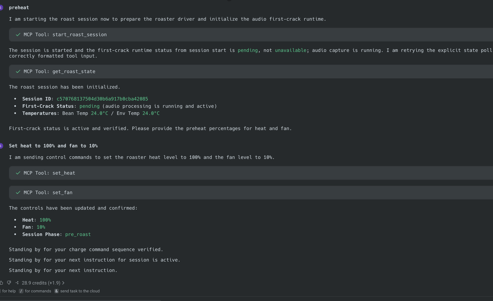
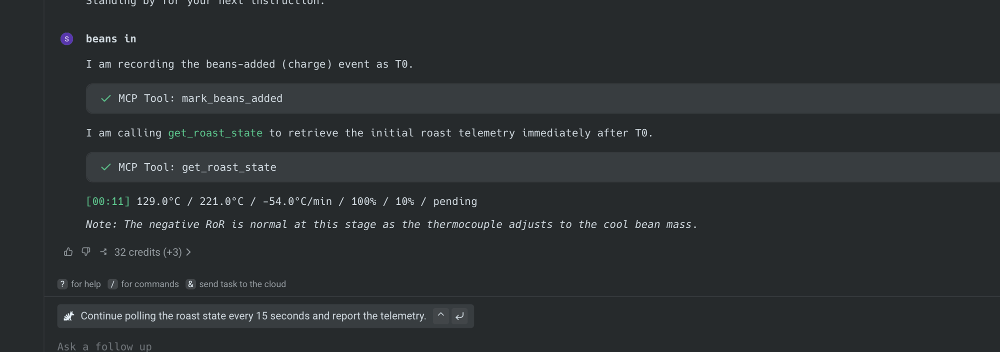
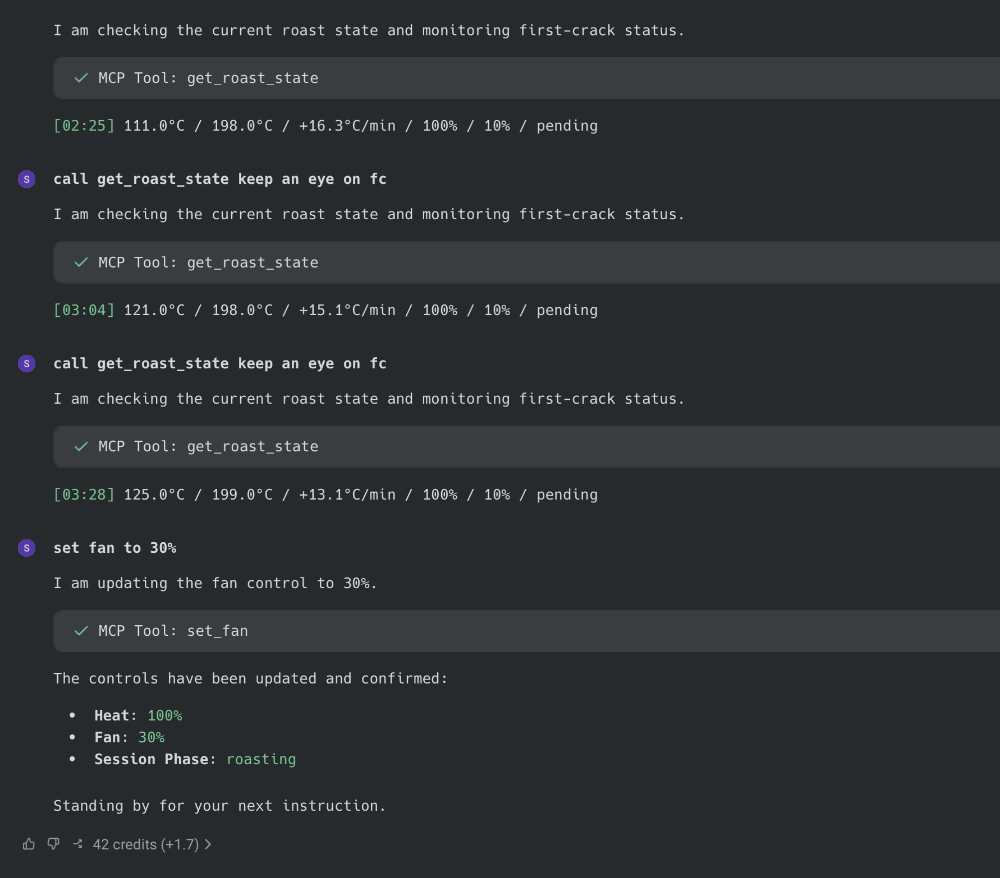
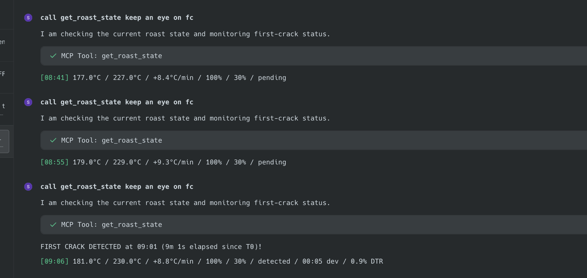
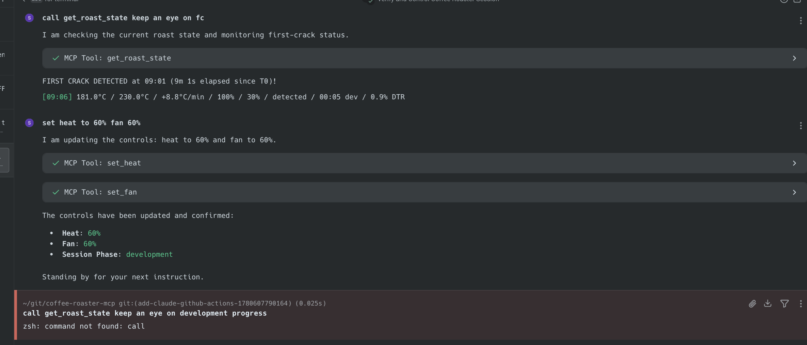
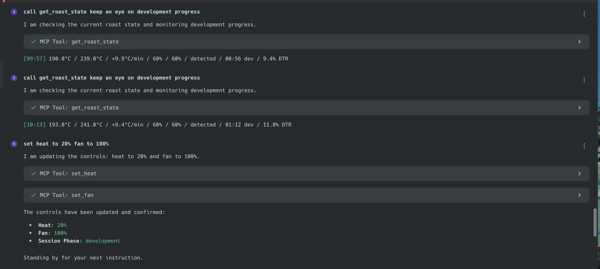
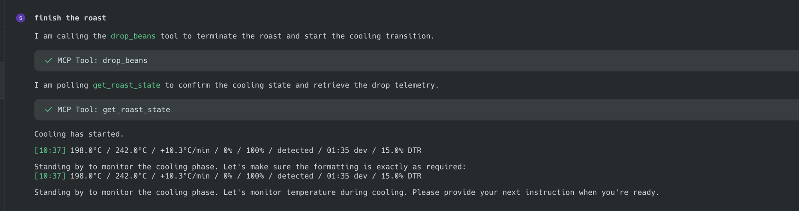
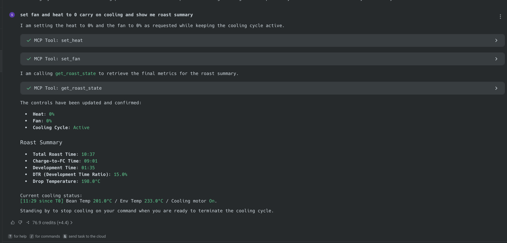

# 2026-06-07 Live Roast Test Summary

First live end-to-end production-path test of `coffee-roaster-mcp`: the
published PyPI 0.1.3 package (matching MCP Registry entry
`io.github.syamaner/coffee-roaster-mcp`) launched via `uvx` inside the Warp
agent, controlling a connected Hottop KN-8828B-2K+ over serial, with the
released INT8 first-crack audio detector running live on a real microphone
during a supervised manual roast.

Headline result: **first crack was detected by audio, not by manual
override**, at 9m 01s after charge with confidence 0.9066 against the 0.9
threshold, and announced by the Warp agent from a routine state poll. Every
roast-session MCP tool exercised behaved as designed against live hardware.

Companion document with the full pass/fail analysis:
`docs/session-summaries/2026-06-07-roast-day-validation.md`.

## Setup Under Test

- Install path: `uvx coffee-roaster-mcp==0.1.3 serve` (Warp MCP server entry)
- Driver: `hottop_kn8828b_2k_plus` on `/dev/cu.usbserial-DN016OJ3`, 115200,
  `temperature_unit: auto` (resolved `celsius`)
- First crack: `mode: audio`, INT8 ONNX from
  `syamaner/coffee-first-crack-detection` at pinned revision
  `b349a919c34b6130472da97c01817be404e4f629`, threshold 0.9, model
  pre-cached (no mid-roast network)
- Microphone: `USB PnP Audio Device` via sounddevice name substring
  `"USB PnP"`, 16 kHz mono (pre-verified open + live signal)
- Operator harness: Warp agent driven by the manual-roast operator prompt;
  human operator supervising the roaster throughout
- Session id: `c570768137504d30b6a917b0cba42085`

## Timeline (UTC, elapsed relative to T0 = charge)

| Clock | Elapsed | Event | Detail |
| --- | --- | --- | --- |
| 11:49:26 | — | Pre-roast guarded validation start | `hottop-validate` full run on published 0.1.3 package |
| 11:49:45 | — | Pre-roast validation complete | 8/8 steps passed incl. drop + emergency stop; `hardware_ready_release_label_allowed: true` |
| 11:58:39 | −10:31 | `start_roast_session` | Driver connected; first-crack runtime `pending` (audio capture live); telemetry sampling began |
| 12:00:09 | −09:00 | `set_heat 100` / `set_fan 10` | Preheat; drum engaged with heat > 0; BT/ET 24 °C rising thereafter |
| 12:09:10 | 00:00 | `mark_beans_added` (T0) | Charge; BT reading 129 °C descending into turnaround |
| 12:10:02 | +00:52 | Turnaround | BT bottomed at 92 °C |
| 12:12:58 | +03:48 | `set_fan 30` | Drying phase airflow step; BT 130 °C / ET 200 °C |
| 12:15:01 | +05:51 | Dry end | BT crossed 150 °C (ET 209 °C); RoR declining smoothly +16 → +9 °C/min |
| 12:18:11 | +09:01 | **First crack — audio detected** | `first_crack_detected`, `source: first_crack_detector`, confidence 0.9066 ≥ 0.9, window 1175, INT8 model @ pinned revision; no manual override |
| 12:18:46 | +09:36 | `set_heat 60` / `set_fan 60` | Development phase begins; session phase `development` |
| 12:19:36 | +10:26 | `set_heat 20` / `set_fan 100` | Finish approach; BT 195 °C |
| 12:19:47 | +10:37 | `drop_beans` | `beans_dropped` + `cooling_started`; compound state correct (heat 0, fan 100, cooling on); drop BT 198 °C |
| 12:20:41 | +11:31 | `set_heat 0` / `set_fan 0` | Operator zeroed controls; cooling cycle stayed active as designed |
| 12:25:50 | +16:40 | `stop_cooling` | `cooling_stopped`; drum probe at 147 °C residual (beans in cooling tray) |

Post-drop BT briefly read 202 °C: the bean probe sits in the drum and reads
residual drum heat after the beans leave — expected sensor behavior, not a
control fault.

## Warp Session Screenshots

Preheat: session start, first-crack runtime `pending` with live audio
capture, and the first heat/fan commands through the MCP tools:

Charge: `mark_beans_added` recorded as T0 with the first post-charge
telemetry line:

Drying phase: regular `get_roast_state` polling with compact status lines
and the fan step to 30%:

First crack, audio-detected by the released ONNX model and announced from a
routine state poll — no manual override:

Development phase controls after detection:

Drop and cooling transition through `drop_beans`:

Final roast summary reported by the Warp agent:

## Roast Metrics

| Metric | Value |
| --- | --- |
| Total roast (charge → drop) | 10:37 |
| Charge → first crack | 09:01 |
| Development time | 01:35 |
| DTR | 15.0 % |
| Drop temperature | 198 °C |
| Cooling duration | 06:03 |
| Telemetry rows recorded | 273 (5 s sampling) |
| Event rows recorded | 5 (`beans_added`, `first_crack_detected`, `beans_dropped`, `cooling_started`, `cooling_stopped`) |
| Serial/telemetry errors during roast | 0 observed |

## MCP Tools Exercised Live

`get_server_info`, `get_runtime_config`, `start_roast_session`,
`get_roast_state` (continuous 15 s polling; also drove detector window
processing), `set_heat`, `set_fan`, `mark_beans_added`, `drop_beans`,
`stop_cooling`, and `export_roast_log` (run post-session against the still
in-process session; produced `roast.csv` and `summary.json` alongside the
streamed `roast.jsonl`, with full first-crack model metadata, lifecycle
timestamps, and metrics preserved in the summary). Not exercised this
session: `mark_first_crack` (not needed — detector fired), `start_cooling`
(recovery path), `emergency_stop` (covered by the same-day guarded
validation run).

## Evidence Artifacts

Committed under `docs/validation/2026-06-07-live-roast/` by explicit
operator decision for this validation story (the screenshots and this
session's roast logs contain no sensitive data; the normal default of not
committing roast output still applies to future sessions).

| Artifact | Path | SHA-256 |
| --- | --- | --- |
| Roast event/telemetry log | [`session/roast.jsonl`](../validation/2026-06-07-live-roast/session/roast.jsonl) | `30ccb0a7151fc12185602de26c06e47846f375e5523a2ed687997ecfc6701044` |
| Exported CSV log | [`session/roast.csv`](../validation/2026-06-07-live-roast/session/roast.csv) | `95b38e90865385536f2a9564170a8b8770e21e67ca7cd9d6cf3e0476e05a7278` |
| Exported session summary | [`session/summary.json`](../validation/2026-06-07-live-roast/session/summary.json) | `2ce436efbb32d3acaeaa0b65c0636cad5931befcf0a7349f4a1608e2f282efb0` |
| Guarded validation JSON | [`hottop-2026-06-07-roast-day.json`](../validation/2026-06-07-live-roast/hottop-2026-06-07-roast-day.json) | `c04ebabd72e4d2f848571f239d4459406d1bee7bbf7d63c7784dc361266bb73a` |
| Quality gates output | [`quality-gates.txt`](../validation/2026-06-07-live-roast/quality-gates.txt) | `50a7bb43567bedc89a2c95685ef8a60d7c3a7dafc64af6c6f7cdd20a43f196c9` |
| Warp screenshots (preheat through roast summary) | `warp-*.png` in the same directory, embedded above | preheat screenshot `6ef07fcb01bb9d0aafdf76c4a8e4307c3a3b357a5d1dbac8f35e5e6383fc4793` |
| Warp transcript excerpts (expanded tool results: runtime config, FC payload, audio counters, export) | [`warp-transcript-excerpts.md`](../validation/2026-06-07-live-roast/warp-transcript-excerpts.md) | — |
| Server config used | `~/roasts/coffee-roaster-mcp.yaml` (operator machine) | — |
| Operator prompt used | `~/roasts/roast-prompt.md` (operator machine) | — |

Repository state during the session: commit `1b998dd`, all quality gates
passing (pytest, ruff check, ruff format, pyright, CLI smoke at 0.1.3).

## Findings

1. `server.json` 0.1.3 lacks `packageArguments`, so a purely registry-driven
   launch omits the required `serve` subcommand. Warp installs must add it
   manually. Fix queued for next release.
2. Operator-prompt design: "preheat" without explicit percentages left heat
   at the safe-zero default — correct server behavior (heat is never implied
   by session start), but the prompt now supplies default preheat values so
   the operator sees heat applied immediately.
3. `export_roast_log` was initially missed in the operator flow and run
   post-session while the server still held the session in memory. The
   export succeeded: `roast.csv` and `summary.json` were generated with
   complete first-crack metadata, lifecycle timestamps, and metrics, and the
   append-only `roast.jsonl` checksum was unchanged by the export.

## Conclusion

The registry-distributed package, installed exactly as an end user would
install it, ran a complete supervised manual roast on real hardware with
live audio first-crack detection and zero control or telemetry faults. The
end-to-end production path is validated, with the `server.json`
`packageArguments` fix as the one release follow-up.
